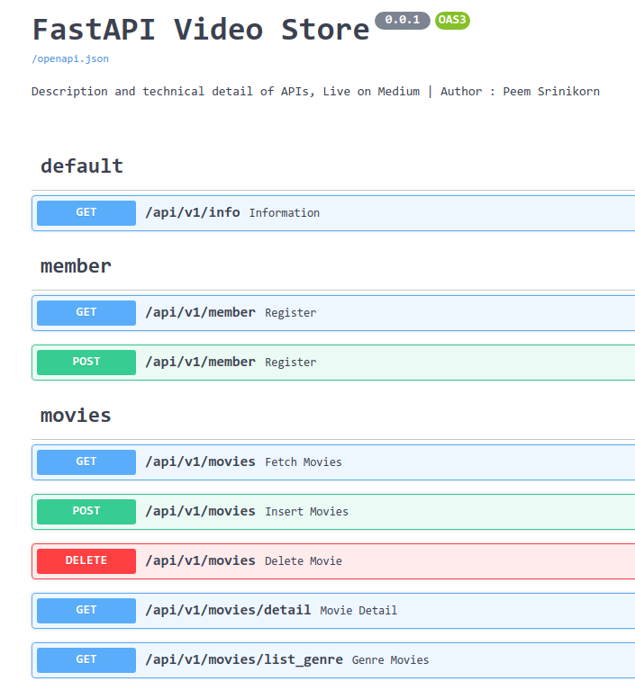

# FastAPI Movies Store

### Author : Peem Srinikorn

Example of API code using FastAPI.   
Let's Unleash the API with FastAPI feature contains Python 3, Asynchronous server, Modernization, Powerful API Document, GraphQL, WebSocket  

------- 
## Medium (Thai Language)

[[Review] สร้าง API ด้วย FastAPI เร็ว แรง ฟิ้ว ๆ](https://medium.com/@p.srinikorn/review-%E0%B8%AA%E0%B8%A3%E0%B9%89%E0%B8%B2%E0%B8%87-api-%E0%B8%94%E0%B9%89%E0%B8%A7%E0%B8%A2-fastapi-%E0%B9%80%E0%B8%A3%E0%B9%87%E0%B8%A7-%E0%B9%81%E0%B8%A3%E0%B8%87-%E0%B8%9F%E0%B8%B4%E0%B9%89%E0%B8%A7-%E0%B9%86-148b10416a70)    


[สร้าง CI/CD Pipeline ด้วย Google Cloud Build ภายใน 5 นาที !!!](https://medium.com/@p.srinikorn/%E0%B8%AA%E0%B8%A3%E0%B9%89%E0%B8%B2%E0%B8%87-ci-cd-pipeline-%E0%B8%94%E0%B9%89%E0%B8%A7%E0%B8%A2-google-cloud-build-%E0%B8%A0%E0%B8%B2%E0%B8%A2%E0%B9%83%E0%B8%99-5-%E0%B8%99%E0%B8%B2%E0%B8%97%E0%B8%B5-56abf2472567)


## Prepare Project
```
pipenv shell --python 3
pipenv install -r requirements.txt
```

## Run
```
python main.py
```

## Test 
```
pytest -v 
```

## Docs
```
0.0.0.0:8080/docs
```

## Example of FastAPI and Google Cloud Build CI/CD

### API Documents   



### Interactive Documents    


#### GitHub CI/CD workflow with Google Cloud     


